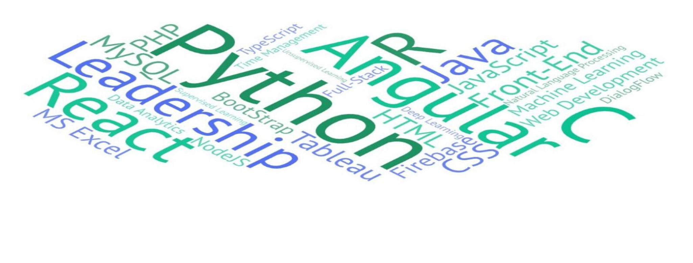

## Hello there 👋

📌 I am **Jaynil Gaglani**, pursuing `B.Tech in I.T. Engineering` from *Sardar Patel Institute of Technology, Mumbai*. I am interested in learning new technologies and build exciting real-world projects.

📌 I am `extremely motivated` to constantly develop my skills and *grow professionally*. **Self-learning ability** and `passion for my work` are the key factors towards my success.

📌 My technical skills include :

 - 🎯 *Languages* (**`C, Java, Python, R`**)

 - 🎯 *Front-End Development* (**`HTML, CSS, BootStrap, JavaScript, React, Angular`**)

 - 🎯 *Backend Development and Database Management* (**`SQL, Firebase, Micronaut`**)

 - 🎯 *Machine Learning, NLP and Deep Learning*
